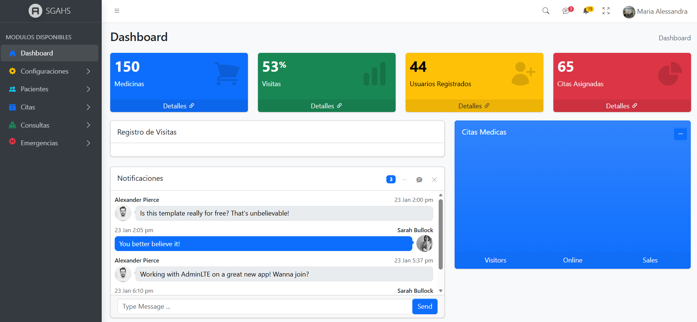

# SGAHS (Aun en desarrollo)
Una herramienta digital web para llevar el control de distintos procesos críticos de una clínica u hospital. Este proyecto fue realizado en el framework Symfony.

Vista Previa

- Para más información del framework, click en este enlace: [Documentacion Symfony](https://symfony.com/doc)

## Procesos
### - Gestion de Citas Médicas (Completado)
Externamente, solo se permitirá la gestión de citas propias, incluyendo solicitud de la cita (si se permite, anexar ciertos archivos PDF, DICOM, JPG), cancelación y consultas de citas anteriores, Internamente se permitirá la configuración de los horarios de atención, consultorios disponibles, cupos disponibles, prioridad de asignación de cita (con base en la edad del paciente), consulta de citas pendientes para fechas específicas y permitir marcar las citas como asistidas.

### - Creación y gestión de historias clínicas (Completado)
Internamente, se permitirá el registro de pacientes, creación de la historia medica del paciente, continuación de la historia médica, consulta de la historia médica. Adicionalmente se permitirá la asociación automática de usuarios registrados con pacientes existente y viceversa.

### - Gestión de eventos de emergencia (En Desarrollo)
Se permitirá el registrar nuevas emergencias (paciente, situación, hora de entrada, hora de registro, tratamiento realizado, clasificación de la emergencia, prioridad, estado actual, observaciones) y una vez registrada se permitirá anexar entradas posteriores sobre el desarrollo de la emergencia con el fin de permitir monitorear en tiempo real, adicionalmente si el paciente de la emergencia no está registrado, se permitirá el registro y se le creara automáticamente una historia medica asociando la emergencia como primera entrada, de ser necesario también permitirá asociar la emergencia a una entrada de quirófano.

### - Gestión visitas institucionales (En Desarrollo)
Internamente se permitirá configurar los horarios de visitas, pacientes a los cuales se les permite visitar, número máximo de visitas por paciente, restricciones de visitas por paciente, registro de visitas realizadas a un paciente en específico (datos del visitante, motivo, hora de entrada y salida).

### - Gestión y organización del Quirófano (En Desarrollo)
Este proceso permitirá administrar toda la gestión del quirófano, desde la planificación de entradas, salidas, preoperatorios necesarios antes de iniciar, procedimientos a realizar, doctores permitidos, insumos necesarios, paciente a operar, monitoreo del paciente después del quirófano, y cierre del procedimiento. Todo esto también será agregado automáticamente a la historia médica del paciente.

## Seguridad y Roles
1. <strong>Jefe de Institución:</strong> Acceso a todos los módulos del sistema, incluyendo auditoria, gestión de cuentas de usuarios internos y externos, respaldo de base de datos, restauración de base de datos.
2. <strong>Administrador de Sistema:</strong> Acceso a configuraciones necesarias del sistema como configuración de citas, horarios de visititas, entre otros. También disponen de acceso a la auditoria del sistema, gestión de cuentas de usuarios internas, gestión de cuentas de usuarios externas, respaldo y restauración de la base de datos. Sin embargo, no cuentan con acceso a las historias médicas, ni a información del módulo de quirófano, ni al módulo de emergencias, ni validación de citas.
3. <strong>Doctor:</strong> Acceso completo a historias medicas de los pacientes, control de visitas, consulta y validación de citas, gestión de quirófano y gestión de emergencias, pero no cuenta con acceso a configuraciones de citas, horarios de visitas, auditoria, gestión de usuarios ni respaldo o restauración de la base de datos.
4. <strong>Receptor:</strong> Solo tiene acceso a consulta de historias médicas y continuación de las mismas, registro y continuación de emergencias, consulta de quirófano y continuación de monitoreo de entradas.
5. <strong>Paciente:</strong> Autogestión de información personal

## Requerimientos
1. Debe tener PHP >= 8.2 (Symfony 7.3 lo requiere)
2. Debe tener Composer instalado (Para instalar los paquetes y librerias necesarias)
3. Debe tener Docker instalado (Para correr la base de datos, Docker Desktop también sirve)
4. Debe tener Node instalado (Para instalar los paquetes de JS)

Si tiene los requerimientos, clone el repositorio, abra la consola, navegue hasta el directorio del proyecto y ejecute lo siguiente en la consola

### Instale las Librerias
Instalar librerias:
```bash
composer install
```
Instalar librerias js:
```bash
npm install
```
Instalar y crear contenedor de Docker:
```bash
docker compose up -d
```

### Instale la base de datos
Crear Base de datos (si el contenedor de docker esta corriendo)
```bash
php bin/console doctrine:database:create
```
Subir tablas
```bash
php bin/console doctrine:schema:update --dump-sql --force
```

### Inicie el Proyecto
Compile los js
```bash
npm run dev
```
Inicie el servidor local
```bash
symfony server:start 
```

Navegue hasta el servidor local en [https://127.0.0.1:8000/login](https://127.0.0.1:8000/login)
